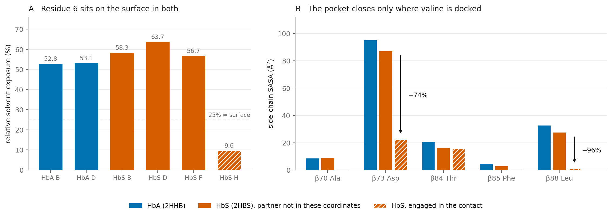
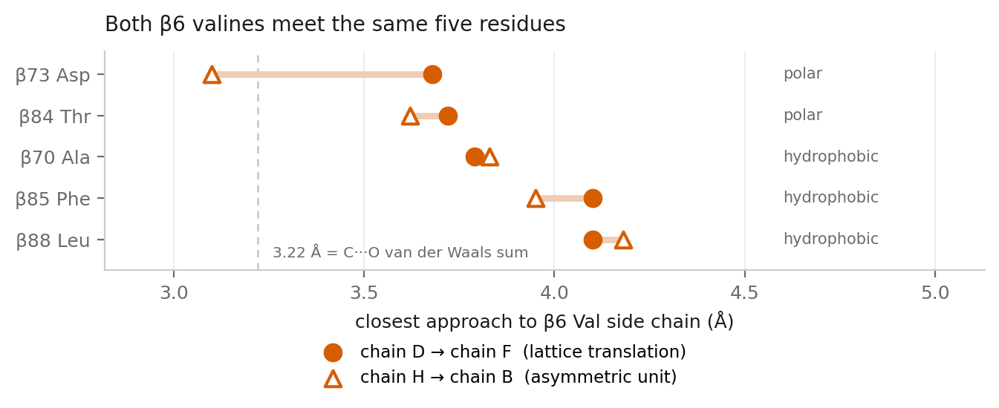
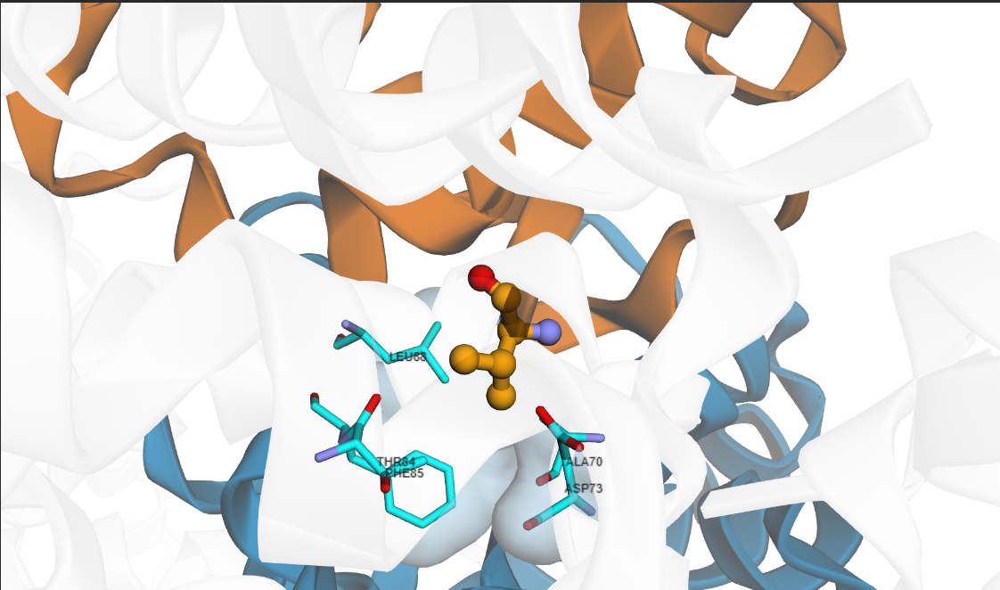

# Structural basis of the sickle cell mutation

A structural comparison of normal human deoxyhaemoglobin (HbA) and deoxyhaemoglobin S (HbS), the variant that causes sickle cell disease. The two proteins differ by **one amino acid in 146**. This repository measures what that single substitution changes, and locates the intermolecular contact through which HbS molecules polymerise.

| Structure | |
|---|---|
| **2HHB** | Normal human deoxyhaemoglobin, 1.74 Å, P 1 21 1 |
| **2HBS** | Deoxyhaemoglobin S, 2.05 Å, P 1 21 1, two tetramers per asymmetric unit |

---

## Findings

### 1. Exactly one difference, at position 6

A residue-by-residue comparison of both β chains returns a single mismatch: **Glu6 → Val6**. The α chains are identical. Any difference measured downstream can only come from position 6.

### 2. The substitution removes charge without burying the residue

Residue 6 is solvent-exposed in both proteins — **53.0 %** relative exposure for Glu6 in HbA, **59.6 %** for the Val6 copies not engaged in a contact. The mutation does not move the residue inside the protein. It swaps a charged carboxylate for a branched hydrocarbon in the same exposed position.

Formal charge per tetramer shifts from **+2 to +4**: each β subunit loses one negative charge. This is the physical basis of haemoglobin electrophoresis — HbS carries less negative charge and migrates more slowly toward the anode.

### 3. The valine docks into a hydrophobic pocket on a neighbouring molecule

One β6 Val drops to **9.6 %** exposure. It is not folded inward — it is inserted into a pocket on the β chain of a *different* haemoglobin tetramer, burying **93 Ų, 86 % of its side-chain surface**.

- **23 intermolecular atom pairs** within 5 Å
- Closest approach **3.10 Å**
- Pocket residues contacted: **β70 Ala, β73 Asp, β84 Thr, β85 Phe, β88 Leu**

β85 Phe and β88 Leu form the floor of the pocket. In the accepting chain their side-chain exposure collapses — β73 Asp by **74 %**, β88 Leu by **96 %** relative to the chains whose pockets are empty.

### 4. The same contact repeats by lattice translation

Applying the crystal symmetry operators reveals a second donor–acceptor pair: chain **D** docks into chain **F** through `x,y,z + (-1, 0, 0)` — a pure one-unit-cell translation, no rotation. Each tetramer donates one valine and accepts one, and the pairing repeats along a crystallographic axis. That repeat is what a fibre is.

### 5. Control: the pocket exists in normal haemoglobin, and nothing occupies it

β85 Phe and β88 Leu are present in HbA at comparable exposure. The hydrophobic pocket is a normal feature of healthy haemoglobin; what HbA lacks is anything to put in it. Glu6 in HbA does contact a symmetry neighbour — Asn68, Asp64, His72 — but every partner is polar or charged. No hydrophobic contact anywhere.

---

## Figures



*Residue 6 exposure across all six β chains, and side-chain exposure of the five acceptor-pocket residues. The pocket collapses only in the chain receiving a valine.*



*Closest approach from each β6 Val to the five pocket residues, for both donor–acceptor pairs.*



*β6 Val (orange) inserted into the acceptor pocket on a neighbouring tetramer.*

---

## Method

| Step | Tool |
|---|---|
| Structure parsing, chain assignment, crystal symmetry expansion | `gemmi` |
| Solvent-accessible surface area (Shrake–Rupley) | `biopython` |
| Neighbour search | `scipy.spatial.cKDTree` |
| Three-dimensional rendering | `py3Dmol` |

α and β chains are assigned by residue count (141 and 146) rather than by chain label, so the code works regardless of how a PDB entry names its chains. Relative exposure uses the theoretical maximum per residue type from Tien *et al.* (2013), which makes Glu and Val comparable despite their different sizes.

Contact searches over the deposited coordinates apply no crystal symmetry, so every contact reported there is between molecules the depositors modelled. Symmetry-related contacts are computed separately and labelled as such. One consequence: chain F's pocket reads as unoccupied in the per-chain exposure table, because the valine filling it belongs to a translated copy that is not in the file.

## Repository layout

```
notebooks/01_structure_comparison.ipynb   complete analysis
structures/                               2HHB.pdb, 2HBS.pdb as downloaded from the RCSB PDB
results/                                  every table produced, as CSV
figures/                                  figures used above
```

## Reproducing

Open the notebook in Google Colab and run it top to bottom. It downloads both structures itself.

```bash
pip install gemmi biopython py3Dmol
```

## Data sources

- Fermi G, Perutz MF, Shaanan B, Fourme R (1984) **2HHB** — the crystal structure of human deoxyhaemoglobin at 1.74 Å resolution. https://www.rcsb.org/structure/2HHB
- Harrington DJ, Adachi K, Royer WE (1997) **2HBS** — the high resolution crystal structure of deoxyhaemoglobin S. https://www.rcsb.org/structure/2HBS
- Tien MZ, Meyer AG, Sydykova DK, Spielman SJ, Wilke CO (2013) Maximum allowed solvent accessibility of residues in proteins. *PLoS ONE* 8:e80635.

## Author

**Kareem Damilare Oreoluwa** · B.Sc. Biochemistry, University of Lagos
[GitHub](https://github.com/damilare-kareem) [LinkedIn](https://www.linkedin.com/in/damilare-kareem0)
